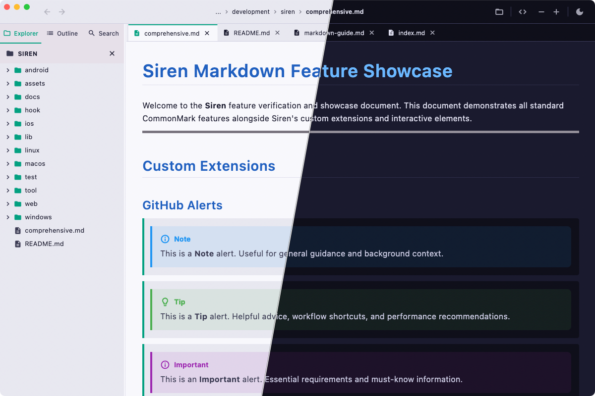
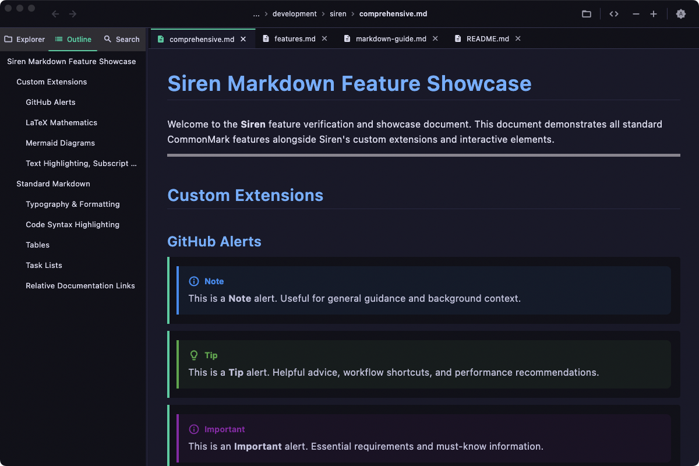
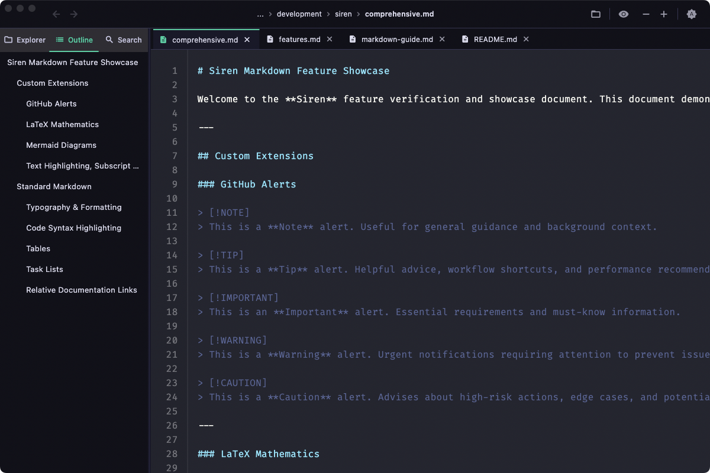
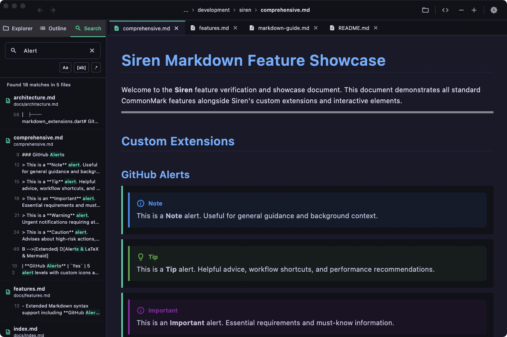
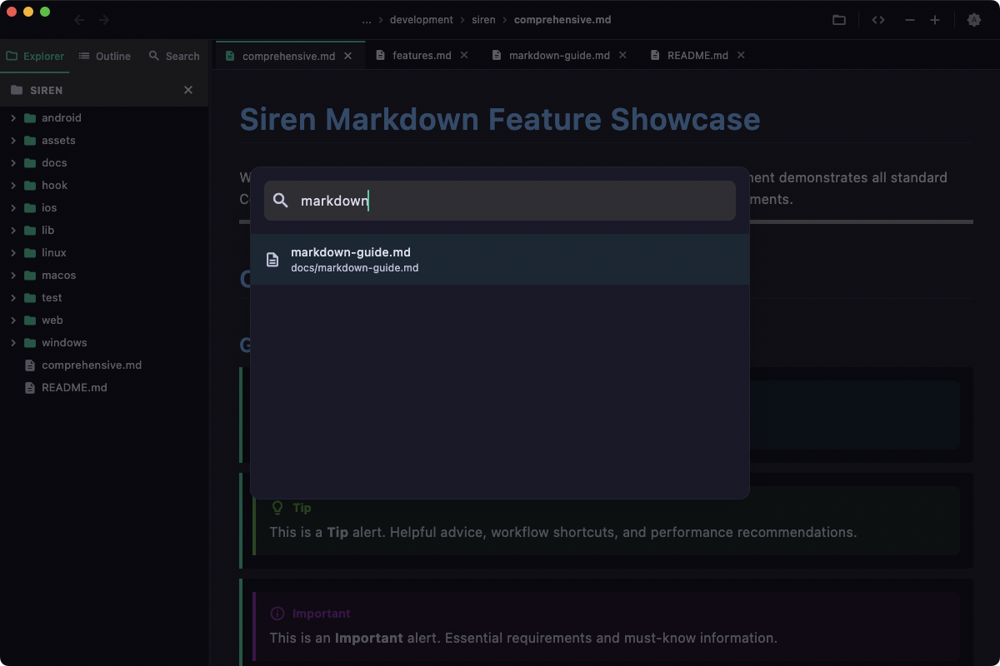
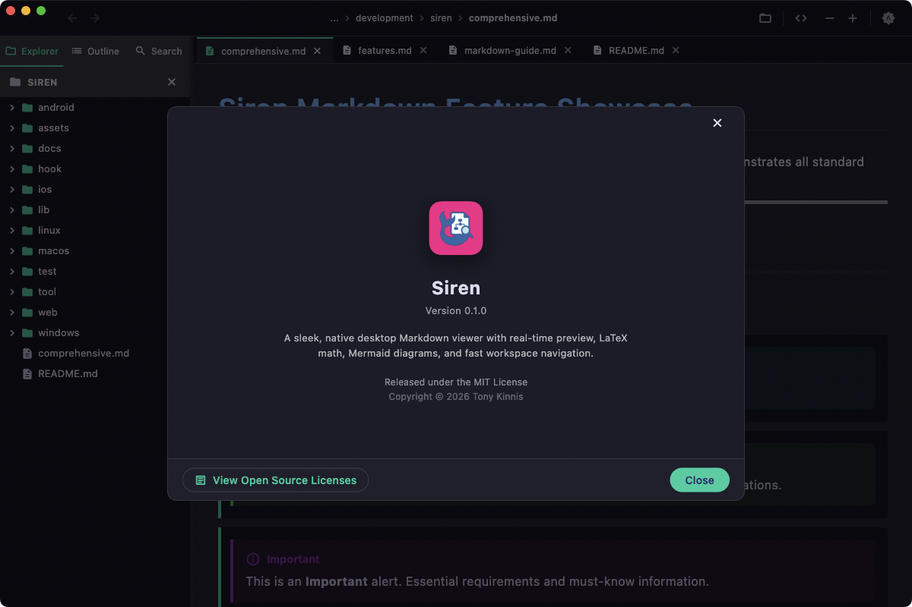
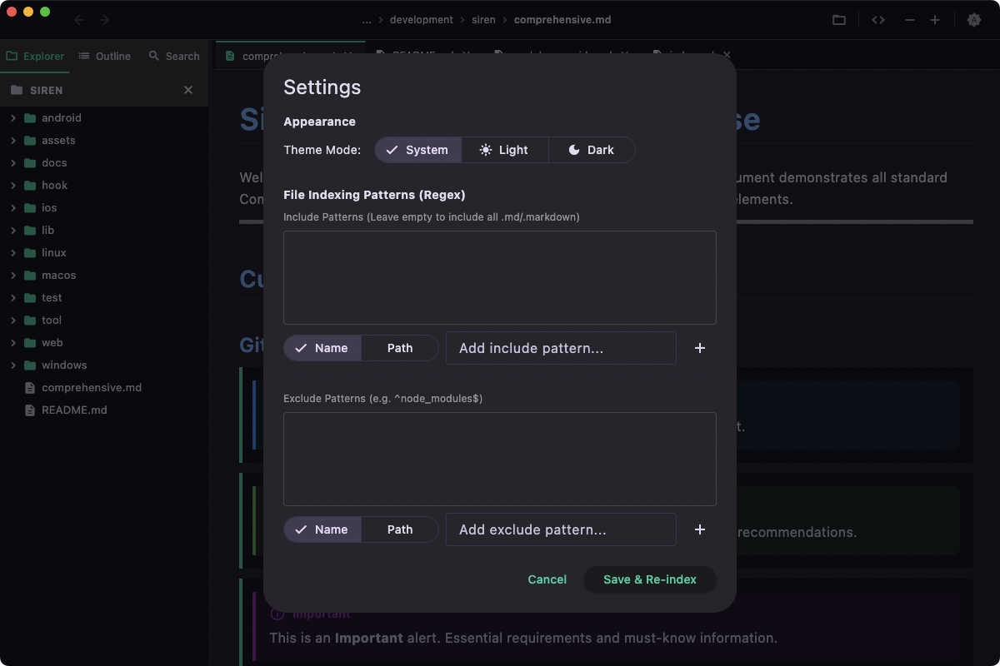
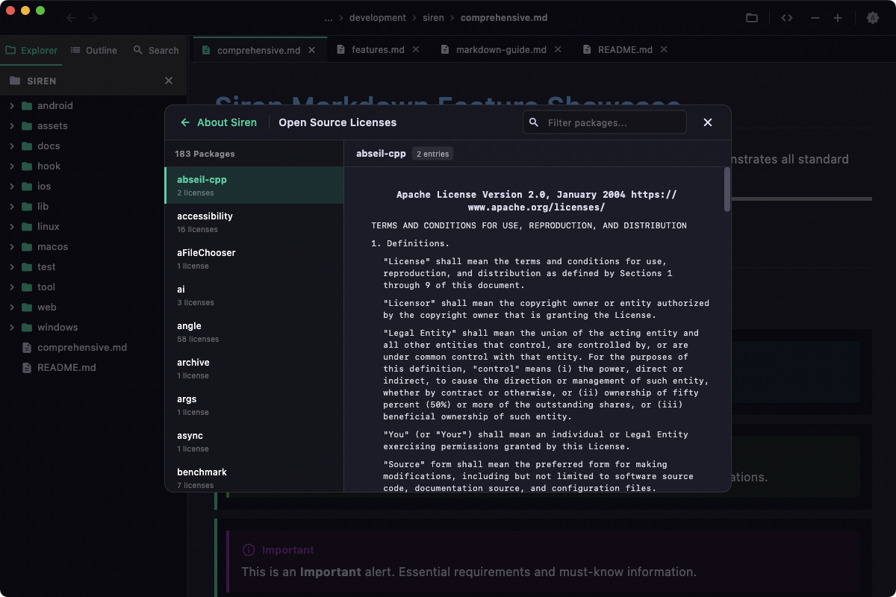

# Siren

<p align="center">
  
</p>

<p align="center">
  <strong>A sleek, high-performance desktop Markdown viewer built with Flutter.</strong>
</p>

<p align="center">
  
  
  <a href="https://github.com/tkinnis/siren/releases/latest"></a>
  
</p>

---



## Overview

**Siren** is a dedicated desktop Markdown viewer engineered for clarity, speed, and elegance. Designed for developers, technical writers, and researchers, Siren delivers full CommonMark rendering alongside modern extensions including GitHub Alerts, LaTeX mathematical typography, Mermaid diagrams, and code syntax highlighting.

With built-in ripgrep-powered full-text search, an interactive document outline, live file-system watching, and instant toggling between rendered documents and raw source with line-number gutters, Siren provides a focused, native environment for reviewing documentation and notes.

---

## Feature Matrix

| Category | Feature | Description | Access / Shortcut |
| :--- | :--- | :--- | :--- |
| **Rendering** | **GitHub Alerts** | 5 color-coded alert levels (`[!NOTE]`, `[!TIP]`, `[!IMPORTANT]`, `[!WARNING]`, `[!CAUTION]`) with custom icons | Automatic |
| | **LaTeX Mathematics** | Typeset inline formulas (`$E = mc^2$`) and block equations (`$$\sum x_i$$`) | CommonMark math blocks |
| | **Mermaid Diagrams** | Flowcharts, sequence diagrams, state machines, and class diagrams | ````mermaid```` code fences |
| | **Code Syntax Highlighting** | Multi-language syntax coloring with monospace formatting | Fenced code blocks |
| | **Extended Formatting** | Text highlighting (`==text==`), subscript (`~sub~`), superscript (`^sup^`), tables, task lists | Extended syntax |
| **Viewer Modes** | **Rendered Preview** | Rich typography, interactive task lists, and diagram rendering | `Cmd + E` (Toggle) |
| | **Raw Source View** | Monospace raw Markdown inspection with aligned line number gutter | `Cmd + E` (Toggle) |
| **Navigation** | **Document Outline** | Auto-extracted heading hierarchy (`#` through `######`) with instant section jump | Sidebar tab / `Cmd + Shift + O` |
| | **File Explorer** | Tree browsing with full support for hidden directories (`.github`, `.docs`) and hidden files | Sidebar tab |
| | **Multi-Tab Workspace** | Drag-and-drop tab reordering, strict single-tab invariant, and closed tab restoration | Tabs / `Cmd + Shift + T` |
| | **Navigation History** | Back and Forward history traversal with disabled bound indicators | Toolbar / `Cmd + [` / `Cmd + ]` |
| **Search** | **Workspace Ripgrep** | Embedded binary full-text search across thousands of files with match counts | `Cmd + Shift + F` |
| | **Quick Open** | Background isolate fuzzy finder for instant file switching | `Cmd + P` |
| | **In-File Find** | Active document search with regex support, match counter, and next/prev jumps | `Cmd + F` |
| **Appearance** | **Light & Dark Themes** | Seamless toggling between System, Light, and Dark themes with tailored typography and syntax highlighting | Toolbar icon / `Cmd + Shift + D` |
| | **Settings Configuration** | Modal dialog (`Cmd + ,`) to set default theme mode and customize regex file indexing patterns | `Cmd + ,` |
| **Desktop Integration** | **Live File Watching** | Monitors open documents on disk and auto-reloads upon external edits | Automatic |
| | **Finder Drag & Drop** | Drag files or folders directly into the window to open immediately | Drag & drop |
| | **Desktop About & Licenses** | Native modal dialog with Siren branding and aligned 2-column license browser | App menu > About Siren |

---

## Visual Showcase

### Document Outline & Raw Source View

| Document Outline View | Raw View with Line Number Gutter |
| :---: | :---: |
|  |  |

### Blazing Fast Search Tools

| Ripgrep Global Workspace Search | Quick Open Fuzzy Finder (`Cmd + P`) |
| :---: | :---: |
|  |  |

### Native Desktop Experience & Preferences

| Desktop About Dialog | Application Settings (`Cmd + ,`) |
| :---: | :---: |
|  |  |

| Light & Dark Theme Support | Integrated Licenses Viewer |
| :---: | :---: |
|  |  |

---

## Keyboard Shortcuts

| Shortcut | Action |
| :--- | :--- |
| `Cmd + O` | Open File |
| `Cmd + Shift + O` | Open Folder / Workspace |
| `Cmd + W` | Close Active Tab |
| `Cmd + Option + W` | Close Other Tabs |
| `Cmd + Shift + W` | Close All Tabs |
| `Cmd + Shift + T` | Reopen Recently Closed Tab |
| `Cmd + E` | Toggle Preview / Raw View |
| `Cmd + Shift + D` | Toggle Dark / Light Theme |
| `Cmd + ,` | Open Settings |
| `Cmd + F` | Find in Active File |
| `Cmd + Shift + F` | Global Search (Ripgrep) |
| `Cmd + P` | Quick Open (Fuzzy Finder) |
| `Cmd + ]` / `Cmd + Shift + ]` | Next Tab |
| `Cmd + [` / `Cmd + Shift + [` | Previous Tab |
| `Cmd + +` / `Cmd + =` | Increase Font Size |
| `Cmd + -` | Decrease Font Size |
| `Cmd + 0` | Reset Font Size |
| `Cmd + R` | Reload Current File |

For the complete list of shortcuts, see [docs/shortcuts.md](docs/shortcuts.md).

---

## Documentation

Comprehensive guides and architectural notes are available in the [`docs/`](docs/) directory:

- [Documentation Portal](docs/index.md) — Index and overview of all guides.
- [Feature Walkthrough](docs/features.md) — In-depth guide to viewer modes, navigation, and workspace management.
- [Markdown & Syntax Guide](docs/markdown-guide.md) — Complete syntax reference for GitHub alerts, math, diagrams, and formatting.
- [Keyboard Shortcuts](docs/shortcuts.md) — Exhaustive keyboard shortcut reference.
- [Architecture & Internals](docs/architecture.md) — Technical overview of isolates, ripgrep bundling, and state management.

---

## Download & Installation

### Pre-Built macOS App (Recommended)

Download the latest universal macOS release from [**GitHub Releases**](https://github.com/tkinnis/siren/releases/latest):

1. Download **`Siren-v0.1.0-macos.zip`**.
2. Double-click to extract **`Siren.app`**.
3. Drag **`Siren.app`** into your **`/Applications`** folder and launch.

*Supports macOS 11.0+ on both Apple Silicon (M-series) and Intel Macs.*

---

### Building from Source

#### Prerequisites
- macOS 11.0+ (Big Sur or newer)
- [Flutter SDK](https://flutter.dev/docs/get-started/install/macos) (version 3.47 or newer)
- Xcode (latest command-line tools)

#### Build Instructions

1. **Clone the repository**:
   ```bash
   git clone https://github.com/tkinnis/siren.git
   cd siren
   ```

2. **Install Flutter dependencies**:
   ```bash
   flutter pub get
   ```

3. **Run in development mode**:
   ```bash
   flutter run -d macos
   ```

4. **Build a release application**:
   ```bash
   flutter build macos --release
   ```
   The built application bundle will be located at:
   `build/macos/Build/Products/Release/Siren.app`

---

## Testing & Quality

Run the test suite:
```bash
flutter test
```

Run static analysis:
```bash
flutter analyze
```

---

## License

This project is licensed under the MIT License. See [LICENSE](LICENSE) for details.
