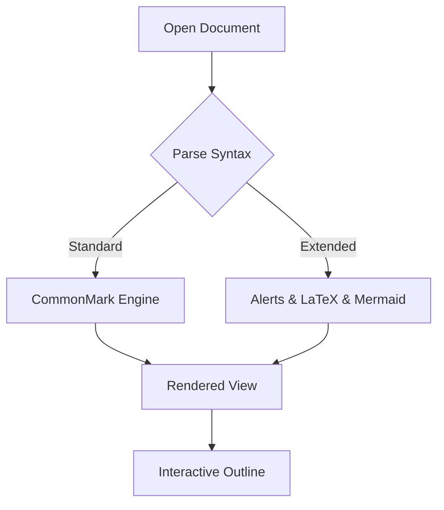

# Siren Markdown Feature Showcase

Welcome to the **Siren** feature verification and showcase document. This document demonstrates all standard CommonMark features alongside Siren's custom extensions and interactive elements.

---

## Custom Extensions

### GitHub Alerts

> [!NOTE]
> This is a **Note** alert. Useful for general guidance and background context.

> [!TIP]
> This is a **Tip** alert. Helpful advice, workflow shortcuts, and performance recommendations.

> [!IMPORTANT]
> This is an **Important** alert. Essential requirements and must-know information.

> [!WARNING]
> This is a **Warning** alert. Urgent notifications requiring attention to prevent issues.

> [!CAUTION]
> This is a **Caution** alert. Advises about high-risk actions, edge cases, and potential data loss.

---

### LaTeX Mathematics

Siren renders beautiful mathematical notation via KaTeX.

**Inline equation**: The mass-energy equivalence is defined as $E = mc^2$, where $c \approx 3 \times 10^8 \text{ m/s}$.

**Block formula**:
$$
\int_{-\infty}^{\infty} e^{-x^2} dx = \sqrt{\pi}
$$

---

### Mermaid Diagrams

Interactive diagrams render natively using Mermaid syntax:



---

### Text Highlighting, Subscript & Superscript

- Text with ==highlighted emphasis== for critical identifiers.
- Chemical formulas: H~2~O, C~6~H~12~O~6~
- Exponents: $x^2 + y^2 = r^2$, or markdown superscripts: 2^10^ = 1024
- Combined notations: A^2^~k~

---

## Standard Markdown

### Typography & Formatting

- **Bold text** with asterisks or underscores.
- *Italic text* for emphasis.
- ***Bold and italic combined***.
- ~~Strikethrough~~ for deprecated content.
- `Inline code snippet` for functions and variables.

### Code Syntax Highlighting

```dart
import 'package:flutter/material.dart';

void main() {
  runApp(const SirenApp());
}

class SirenApp extends StatelessWidget {
  const SirenApp({super.key});

  @override
  Widget build(BuildContext context) {
    return const MaterialApp(
      title: 'Siren',
      home: HomeScreen(),
    );
  }
}
```

### Tables

| Feature | Supported | Description |
| :--- | :---: | :--- |
| **GitHub Alerts** | `Yes` | 5 alert levels with custom icons and borders |
| **LaTeX Math** | `Yes` | Inline (`$`) and display (`$$`) KaTeX formulas |
| **Mermaid Diagrams** | `Yes` | Flowcharts, sequences, and class diagrams |
| **Document Outline** | `Yes` | Auto-generated clickable heading table of contents |
| **Raw Mode Gutter** | `Yes` | Aligned line numbers in monospace raw view |

### Task Lists

- [x] CommonMark specification compliance
- [x] Multi-tab workspace with single-tab invariant
- [x] Real-time file system watching
- [x] Fast fuzzy file search (`Cmd+P`)
- [ ] Export to PDF / HTML

### Relative Documentation Links

Explore more in the official Siren documentation:
- **[Documentation Index](docs/index.md)**
- **[Feature Overview](docs/features.md)**
- **[Markdown Syntax Guide](docs/markdown-guide.md)**
- **[Keyboard Shortcuts](docs/shortcuts.md)**
- **[Architecture & Development](docs/architecture.md)**
