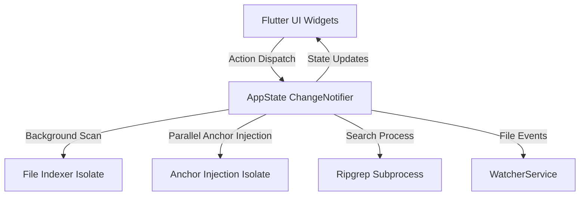

# Siren Architecture & Development

This document describes the architectural design and implementation patterns used in **Siren**.

---

## 1. High-Level Architecture

Siren is built using Flutter for macOS desktop. It employs a reactive unidirectional data flow centered around `AppState`, combined with background Dart isolates to ensure the main UI thread remains responsive at 120 FPS.



---

## 2. Core Subsystems

### State Management (`lib/app_state.dart`)
- Centralized `AppState` extending `ChangeNotifier`.
- Manages open tabs, active document content, navigation history stacks, font sizes, themes, and search states.
- Persists critical UI state (recent files, sidebar visibility, theme, window bounds) to `SharedPreferences`.

### Background Isolates
- **File Indexer (`lib/file_indexer.dart`)**: Traverses the workspace filesystem recursively inside a separate Dart isolate, filtering via include/exclude patterns and building an index of known Markdown documents.
- **Anchor Injection (`lib/markdown_processor.dart`)**: Injects HTML anchors into heading lines in an isolate so that large documents can be indexed and jumped to without blocking user interaction.

### Search Services
- **Fuzzy Matcher (`lib/fuzzy_matcher.dart`)**: Multi-token fuzzy matching with word-boundary and camelCase prioritization.
- **Ripgrep Service (`lib/ripgrep_service.dart`)**: Spawns a background `rg` process with JSON output parsing for high-throughput global workspace searches.

### Live File Watching (`lib/watcher_service.dart`)
- Monitors file system modification and removal events.
- Employs debounce timers and delay strategies to handle macOS atomic saves (where editors write to a temporary file, delete the original, and rename).

---

## 3. Directory Structure

```text
siren/
├── assets/             # Bundled application assets and screenshots
├── docs/               # User and developer documentation
├── lib/                # Flutter Dart source code
│   ├── app_state.dart          # Core application state
│   ├── editor_tabs.dart        # Workspace tab bar with drag-and-drop
│   ├── file_explorer.dart      # Directory tree view
│   ├── file_search_modal.dart  # Quick Open (Cmd+P) dialog
│   ├── find_in_file_bar.dart   # In-document search bar
│   ├── global_search_view.dart # Workspace full-text search
│   ├── home_screen.dart        # Main window scaffold & toolbar
│   ├── markdown_extensions.dart# GitHub alerts, math, & syntax parsers
│   ├── outline_view.dart       # Heading hierarchy tree
│   ├── raw_view.dart           # Raw Markdown editor with line gutter
│   ├── rendered_view.dart      # Formatted Markdown view
│   └── theme.dart              # Light & dark theme extensions
├── macos/              # macOS native Runner project
└── test/               # Comprehensive automated test suite
```

---

## 4. Development & Testing

### Prerequisites
- Flutter SDK `^3.13.0` (Dart `^3.13.0`)
- macOS 12.0 or newer
- Xcode and Command Line Tools

### Setup and Running
```bash
# Clone the repository
git clone https://github.com/tkinnis/siren.git
cd siren

# Install dependencies
flutter pub get

# Run on macOS desktop
flutter run -d macos
```

### Running Tests
Siren includes extensive unit and widget tests covering Markdown parsing, tab management, fuzzy matching, line number alignment, and history navigation:

```bash
# Run all unit and widget tests
flutter test

# Run static analysis
flutter analyze
```
