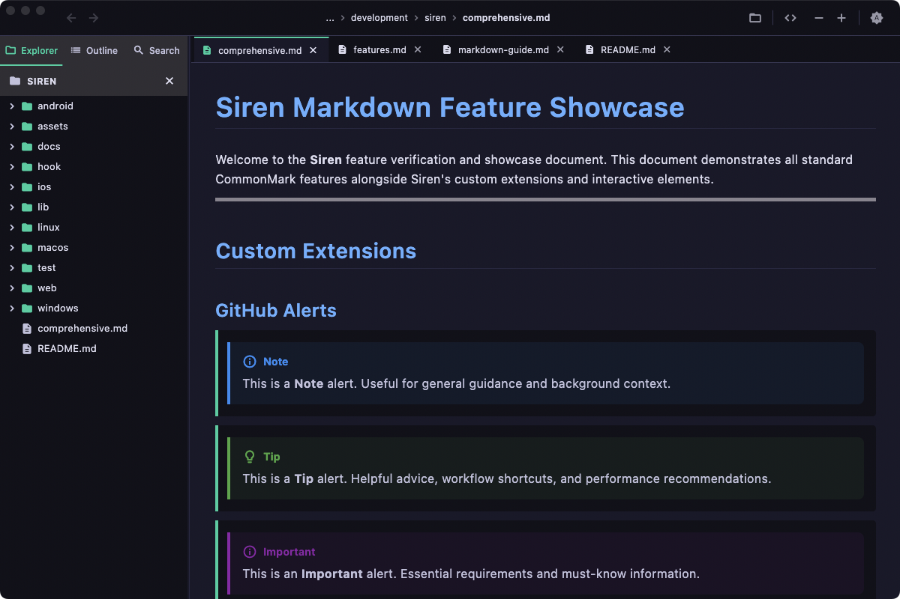

# Siren Features Overview

This guide provides a detailed walkthrough of all the features and capabilities offered by **Siren**.

---

## Feature Matrix

| Category | Feature | Description | Access / Shortcut |
| :--- | :--- | :--- | :--- |
| **Rendering** | **GitHub Alerts** | 5 color-coded alert levels (`[!NOTE]`, `[!TIP]`, `[!IMPORTANT]`, `[!WARNING]`, `[!CAUTION]`) with custom icons | Automatic |
| | **LaTeX Mathematics** | Typeset inline formulas (`$E = mc^2$`) and block equations (`$$\sum x_i$$`) | CommonMark math blocks |
| | **Mermaid Diagrams** | Flowcharts, sequence diagrams, state machines, and class diagrams | ````mermaid```` code fences |
| | **Code Syntax Highlighting** | Multi-language syntax coloring with monospace formatting | Fenced code blocks |
| | **Extended Formatting** | Text highlighting (`==text==`), subscript (`~sub~`), superscript (`^sup^`), tables, task lists | Extended syntax |
| **Viewer Modes** | **Rendered Preview** | Rich typography, interactive task lists, and diagram rendering | `Cmd + E` (Toggle) |
| | **Raw Source View** | Monospace raw Markdown inspection with aligned line number gutter | `Cmd + E` (Toggle) |
| **Navigation** | **Document Outline** | Auto-extracted heading hierarchy (`#` through `######`) with instant section jump | Sidebar tab / `Cmd + Shift + O` |
| | **File Explorer** | Tree browsing with full support for hidden directories (`.github`, `.docs`) and hidden files | Sidebar tab |
| | **Multi-Tab Workspace** | Drag-and-drop tab reordering, strict single-tab invariant, and closed tab restoration | Tabs / `Cmd + Shift + T` |
| | **Navigation History** | Back and Forward history traversal with disabled bound indicators | Toolbar / `Cmd + [` / `Cmd + ]` |
| **Search** | **Workspace Ripgrep** | Embedded binary full-text search across thousands of files with match counts | `Cmd + Shift + F` |
| | **Quick Open** | Background isolate fuzzy finder for instant file switching | `Cmd + P` |
| | **In-File Find** | Active document search with regex support, match counter, and next/prev jumps | `Cmd + F` |
| **Appearance** | **Light & Dark Themes** | Seamless toggling between System, Light, and Dark themes with tailored typography and syntax highlighting | Toolbar icon / `Cmd + Shift + D` |
| | **Settings Configuration** | Modal dialog (`Cmd + ,`) to set default theme mode and customize regex file indexing patterns | `Cmd + ,` |
| **Desktop Integration** | **Live File Watching** | Monitors open documents on disk and auto-reloads upon external edits | Automatic |
| | **Finder Drag & Drop** | Drag files or folders directly into the window to open immediately | Drag & drop |
| | **Desktop About & Licenses** | Native modal dialog with Siren branding and aligned 2-column license browser | App menu > About Siren |

---

## 1. Dual-Mode Markdown Viewer & Editor

Siren lets you work with Markdown files in two distinct modes, toggleable at any time via `Cmd+E` or the toolbar toggle button:

### Rendered Mode
- Clean, typography-focused Markdown rendering compliant with CommonMark.
- Extended Markdown syntax support including **GitHub Alerts**, **LaTeX Math**, and **Mermaid Diagrams**.
- Full support for interactive clickable relative links, images, tables, and task lists.
- Smooth anchor navigation when clicking heading links.



### Raw Mode
- Full raw Markdown source view with a dedicated, aligned **line number gutter**.
- Monospace font with proportional gutter width based on document length.
- Synchronized scroll position when toggling between views.


---

## 2. Document Outline & Sidebar Navigation

The collapsible sidebar (`Cmd+B` to toggle) provides two views accessible via a tab bar:

### Outline View
- Automatically parses the heading structure (`#` H1 through `######` H6) of the currently active document.
- Renders an interactive tree with heading levels, font weights, and indentations.
- Clicking any heading instantly scrolls the document directly to that section.


### File Explorer
- Displays a folder tree of the currently opened workspace root directory.
- Lists all folders and Markdown files (`.md`, `.markdown`).
- **Hidden Files & Folders**: Supports viewing and browsing hidden directories (e.g. `.github`, `.notes`) and hidden markdown files (files starting with `.`).
- **Context Menus**: Right-click to create new files, create new folders, rename, delete, or reveal files in macOS Finder.
- **Drag & Drop**: Drag files and folders directly from Finder into Siren to open them.

---

## 3. Multi-Tab Workspace & Navigation History

Siren features a multi-tab document workspace designed for fluid multitasking:

### Tab Reordering
- Drag and drop tabs horizontally to reorder them to your preferred arrangement.

### Strict Single-Tab Invariant
- A file is never opened more than once. Whether opening a file from the File Explorer, following a link, using Quick Open, or navigating history, Siren always focuses the existing tab rather than creating duplicates.

### History Back / Forward Navigation
- Dedicated **Back** and **Forward** toolbar buttons (and keyboard shortcuts) track your navigation trajectory.
- **Boundary Indication**: The Back and Forward buttons visually dim with reduced opacity and a basic mouse cursor when you have reached the start or end of history.
- **Smart History Pruning**: When you close a tab, it is removed from history so that navigating back never re-opens closed files unexpectedly.

### Reopening Closed Tabs
- Press `Cmd+Shift+T` to instantly restore recently closed tabs in reverse order.

---

## 4. Search and Quick Navigation

Siren provides three levels of search for finding information instantly:

### Quick Open (`Cmd+P`)
- Modal fuzzy file finder powered by Dart background isolates.
- Fast multi-term subsequence matching, boundary matching (`fb` matches `foo_bar`), and camelCase matching.
- Search across thousands of files without UI stutter or latency.


### Global Workspace Search (`Cmd+Shift+F`)
- Fast multi-file full-text search powered by an embedded Ripgrep engine.
- Groups search matches by file with expandable result listings and line numbers.
- Click any match to open the file and jump directly to that line.


### Find in File (`Cmd+F`)
- Integrated in-document search bar for both Rendered and Raw views.
- Case-sensitive and Regex search toggles.
- Real-time match count badge (`3 of 12`).
- Jump between matches with `Enter` (Next) and `Shift+Enter` (Previous).
- Automatic scrolling that centers the active match in the viewport.

---

## 5. Live File System Watching

- Background file watcher monitors open files for changes on disk.
- If an open file is updated or saved externally, Siren automatically reloads and re-renders the document in real time.
- Handles atomic saves and temporary file replacement transparently.

---

## 6. Native macOS Desktop Experience & Settings

- **Native Modal Dialogs**: Clean, modern floating dialogs for Settings and About Siren that respect macOS window buttons and title bar geometry.
- **Desktop Open Source License Browser**: Filterable master-detail view for reviewing third-party dependency licenses with selectable monospace typography.
- **Theme Support**: High-contrast, dark and light themes crafted according to macOS Human Interface Guidelines.
- **Persistent State**: Window size, position, active tabs, and preferences persist seamlessly across application restarts.

### Light & Dark Themes

Siren natively supports **System**, **Light**, and **Dark** themes. Easily toggle between Light and Dark modes at any time with `Cmd+Shift+D` or via the toolbar moon/sun button. Syntax highlighting for code blocks and Markdown alerts adapt dynamically to maintain optimal legibility and contrast in any environment.


### Settings Dialog (`Cmd+,`)

The Settings dialog provides user configuration:
- **Appearance (Theme Mode)**: Choose between System (automatic adaptation to macOS settings), Light, or Dark.
- **File Indexing Patterns (Regex)**: Customize which files and directories are indexed for Quick Open and Workspace Search. Add regular expressions targeting file names or entire paths to explicitly include or exclude patterns (e.g. `^node_modules$`, `build/`).

| Desktop Settings Dialog | Desktop About Siren Dialog |
| :---: | :---: |
|  |  |

| Open Source Licenses Browser |
| :---: |
|  |
