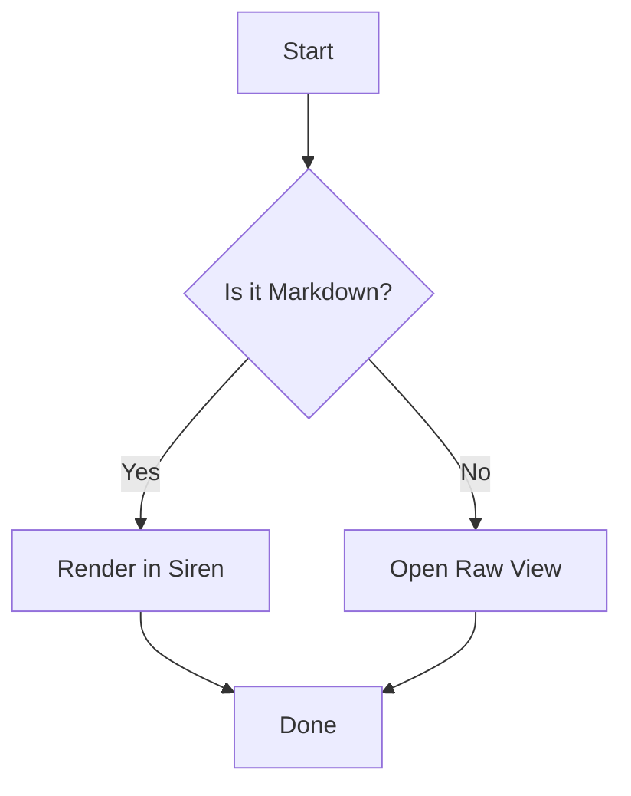
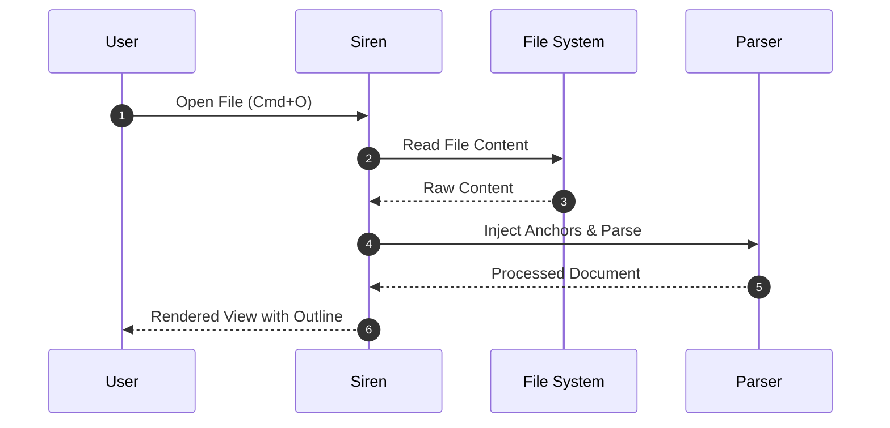

# Markdown Syntax Guide

This guide details all standard and extended Markdown syntax supported by **Siren**.

---

## 1. GitHub-Style Alerts

Siren supports GitHub-style blockquote alerts with dedicated icons, left borders, and contextual background styling:

### Note Alert
```markdown
> [!NOTE]
> Useful information that users should know, even when skimming.
```
> [!NOTE]
> Useful information that users should know, even when skimming.

### Tip Alert
```markdown
> [!TIP]
> Helpful advice or shortcuts for doing things faster or more easily.
```
> [!TIP]
> Helpful advice or shortcuts for doing things faster or more easily.

### Important Alert
```markdown
> [!IMPORTANT]
> Key information crucial for users to achieve their goal.
```
> [!IMPORTANT]
> Key information crucial for users to achieve their goal.

### Warning Alert
```markdown
> [!WARNING]
> Urgent info that needs immediate user attention to avoid problems.
```
> [!WARNING]
> Urgent info that needs immediate user attention to avoid problems.

### Caution Alert
```markdown
> [!CAUTION]
> Advises about risks or negative outcomes that could occur.
```
> [!CAUTION]
> Advises about risks or negative outcomes that could occur.

---

## 2. LaTeX Mathematics

Siren renders mathematical formulas using KaTeX.

### Inline Math
Enclose formulas in single dollar signs:
```markdown
Euler's formula states that $e^{i\pi} + 1 = 0$.
```
Euler's formula states that $e^{i\pi} + 1 = 0$.

### Display / Block Math
Enclose formulas in double dollar signs on their own lines:
```markdown
$$
\int_{-\infty}^{\infty} e^{-x^2} dx = \sqrt{\pi}
$$
```
$$
\int_{-\infty}^{\infty} e^{-x^2} dx = \sqrt{\pi}
$$

---

## 3. Mermaid Diagrams

Siren renders Mermaid diagrams directly within the Markdown document using fenced code blocks labeled `mermaid`.

### Flowcharts


### Sequence Diagrams


---

## 4. Text Formatting & Extensions

### Highlighting
Wrap text in double equals signs to highlight:
```markdown
==Highlighted text== for emphasizing critical terms.
```
==Highlighted text== for emphasizing critical terms.

### Subscript & Superscript
- Subscript: `H~2~O` produces H~2~O
- Superscript: `E = mc^2^` produces E = mc^2^
- Combined: `X^2^~i~` produces X^2^~i~

### CommonMark Line Breaks
In accordance with the CommonMark specification:
- **Soft Line Break**: A single newline in a paragraph joins words with a space.
- **Hard Line Break**: End a line with two spaces or a backslash `\` to create an explicit line break.

---

## 5. Standard Markdown

### Headings
```markdown
# Heading 1 (Document Title)
## Heading 2 (Major Section)
### Heading 3 (Subsection)
#### Heading 4
##### Heading 5
###### Heading 6
```

### Lists
#### Unordered Lists
```markdown
- Bullet point item
- Another item
  - Indented sub-item
```

#### Ordered Lists
```markdown
1. First step
2. Second step
   1. Sub-step A
   2. Sub-step B
```

#### Task Lists
```markdown
- [x] Initial design review
- [x] Implement outline view
- [ ] Write integration test
```

### Tables
```markdown
| Command | Shortcut | Description |
| :--- | :---: | :--- |
| Quick Open | `Cmd+P` | Fuzzy search files |
| Find in File | `Cmd+F` | Search current document |
| Global Search | `Cmd+Shift+F` | Full-text search across workspace |
```

### Code Blocks
Fenced code blocks support syntax highlighting with language identifiers:

```dart
void main() {
  final app = SirenApp();
  app.run();
}
```

### Relative Document Links
Relative Markdown links automatically open target documents in Siren:
```markdown
Check out the [Features Guide](features.md) or [Keyboard Shortcuts](shortcuts.md).
```
If the target document is already open in a tab, Siren switches directly to that tab.
